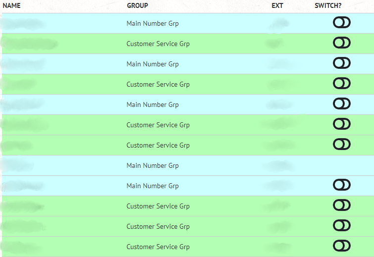

# php-uccx-api-agentchange
## Allow Agents to switch between two queues via Cisco UCCX API v11.x


### I have used this on wordpress with great success
- Queues must be identified using their resource group id's in this example its using resource groups 2 & 3
- The agentswitch.php file should be behind a secure login to prevent malicious switching

### Developer guide from Cisco was very helpful
https://developer.cisco.com/docs/contact-center-express/

## Customize these variables to your environment
```
$apiserver = "x.x.x.x";
$apibasicauth = base64_encode("UCCX_ADMIN_USER:PASSWORD");
$currentpageurl = "site/currentpage.php";
$queue1 = "Customer Service Grp";
$queue1ResGrpID = '2';
$queue2 = "Operator Grp";
$queue2ResGrpID = '3';
```
## Created a Exclusion Section to exclude extensions from either being listed and/or being switched
```
Prevent the following users from being switched with this utility
$userextensions = array("1234","1235","1236","1237");
//Don't even list the users below
$excludedusers = array("1234","1235");
```
